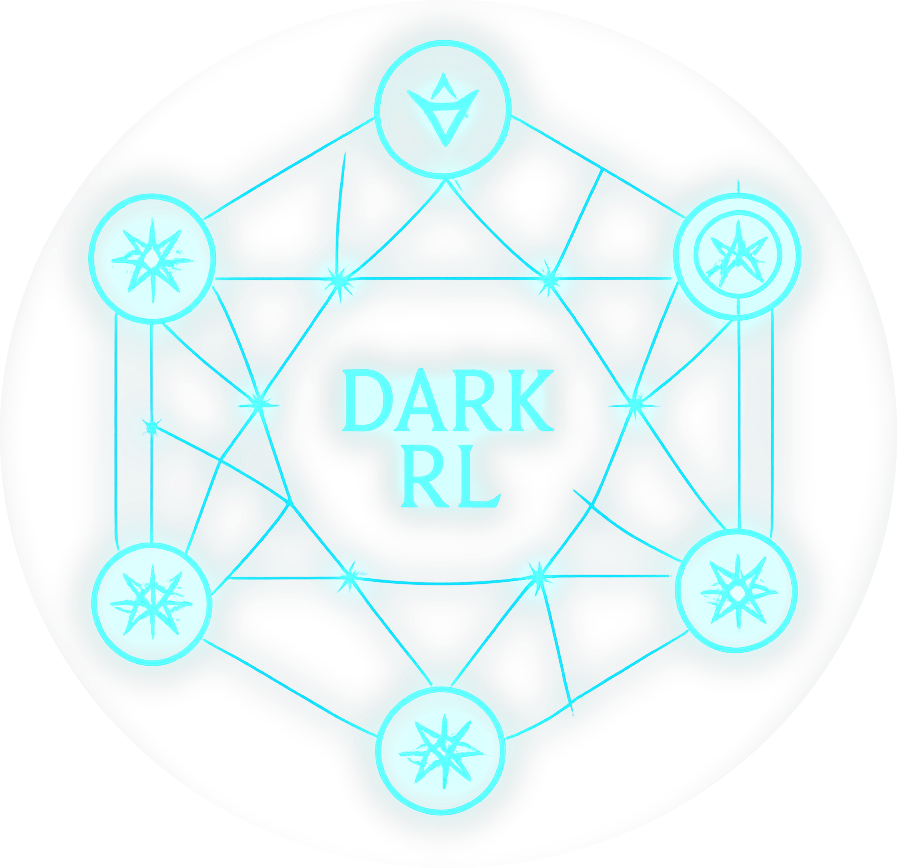

<p align="center">
  
</p>

# Dark RL: Experiments in Interactive Learning

Dark RL provides a high-level interface for interactive, online learning with large language models. The `OnlineLLM` class is the core of this library, offering a simple yet powerful way to generate text, manage skills with LoRA adapters, and fine-tune models on the fly.

> [!WARNING]
> Dark RL is in alpha

## Key Features

- **🧠 Interactive and Online Learning:** Continuously fine-tune your models with new data using LoRA, allowing them to acquire new skills without full retraining.
- **🔌 Adapter-Based Skills:** Manage different LoRA adapters as distinct "skills" that can be loaded and used for specific tasks.
- **🚀 Unified Architecture:** A single model instance handles both training and inference concurrently, using CUDA streams to manage GPU workloads efficiently.
- **💡 Simple API:** A clean and intuitive API that makes it easy to integrate online learning into your applications.

## Interactive Learning

Interactive Learning is a human-in-the-loop training process where an AI model learns incrementally from real-time feedback. Instead of training on a static dataset, the model's understanding is refined through a continuous cycle of action, feedback, and correction.

In Dark RL, this is achieved by:
1.  **Observing** the model's output for a given prompt.
2.  **Providing corrective examples** via the `.learn()` method.
3.  **Updating a LoRA adapter** with this new knowledge.

This approach allows you to "teach" the model new skills, correct its mistakes, and adapt its behavior to specific tasks, much like teaching a human. Because LoRA adapters are small and efficient, this learning process can happen in real-time, making it possible to shape the model's capabilities interactively.

## Quick Start

Here's a minimal example of how to use `OnlineLLM` to generate text and teach the model a new skill.

```python
from dark.online_llm import OnlineLLM

# 1. Initialize the OnlineLLM with a supported model
#    You may need to log in to Hugging Face first: `huggingface-cli login`
llm = OnlineLLM("Qwen/Qwen2.5-VL-7B-Instruct")

# 2. Generate text with the base model
prompt = "What is the capital of France?"
print(f"User: {prompt}")
response = llm.generate(prompt)
print(f"Assistant: {response}")
# Expected output: Paris

# 3. Teach the model a new, fictional skill (e.g., a new language)
#    Let's teach it that "zog" means "hello" in "Zoggian".
learning_examples = [
    {"prompt": "A greeting in Zoggian", "response": "zog"},
    {"prompt": "How to say 'hello' in Zoggian?", "response": "zog"},
]

# The `learn` method fine-tunes a LoRA adapter on your examples.
# We'll name this skill "zoggian-language".
llm.learn(learning_examples, adapter="zoggian-language")
print("\nLearning the Zoggian language...")

# 4. Use the newly acquired skill
#    Now, when we use the "zoggian-language" adapter, the model knows the new word.
prompt_with_skill = "Say 'hello' in Zoggian."
print(f"User: {prompt_with_skill}")
response_with_skill = llm.generate(prompt_with_skill, adapter="zoggian-language")
print(f"Assistant: {response_with_skill}")
# Expected output: zog
```

## Installation

```bash
pip install dark-rl
```
> [!NOTE] 
> A minimum of 48gb VRAM is required

## Unified Training and Inference

Dark RL uses a single model instance to handle both training and inference tasks simultaneously. This is made possible through the use of **CUDA streams**, which allow for the concurrent execution of different GPU operations.

- **Inference Stream:** Generation tasks (i.e., `generate`, `stream`) are run on a dedicated inference stream. This ensures that they are executed with high priority and low latency.
- **Training Stream:** LoRA fine-tuning tasks (`learn`) are run on a separate stream.

This architecture allows the server to remain responsive to inference requests even while the model is being fine-tuned in the background. An `asyncio` lock is used to ensure that the model's LoRA weights are swapped safely between tasks, preventing race conditions.

## Deploying on RunPod with the Interactive UI

You can easily deploy a Dark RL server on a cloud GPU instance like RunPod. Here’s a basic guide for a machine with a 48GB VRAM card (e.g., an RTX A6000).

1.  **Choose a RunPod Template:**
    - Start a new Pod and select the **"RunPod Pytorch 2.6"** template. This provides a clean environment with Python, PyTorch, and CUDA pre-installed.
    - Choose a GPU with at least 48GB of VRAM.

2.  **Connect to the Pod and Start the Server:**
    - Once the Pod is running, connect to it via SSH.
    - First, install `uv` if it's not already available:
      ```bash
      pip install uv
      ```
    - Clone the repository and start the server. `uv` will handle creating a virtual environment, installing dependencies, and running the `websocket_server.py`.
      ```bash
      git clone https://github.com/agentsea/dark.rl.git
      cd dark.rl
      uv run python websocket_server.py
      ```

3.  **Expose the Port:**
    - The websocket server runs on port 8000. In the RunPod dashboard for your Pod, expose this port to make the UI accessible over the internet.

Your Dark RL server is now running and ready for interactive learning.

## Inspiration
* Darknet
* Nano-VLLM
